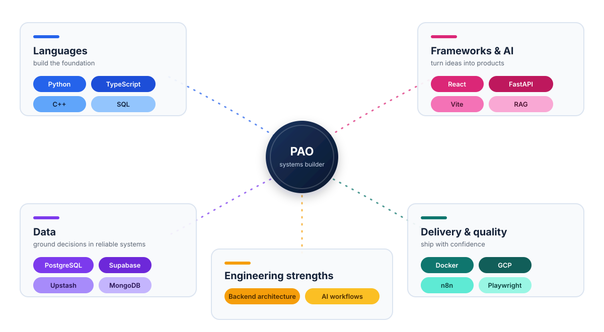

  <h1>Paolo Iñigo S. De la Paz</h1>
  
<strong>Full-stack engineer focused on backend architecture, data systems, and AI applications.</strong>

  

    <a href="https://portfolio-project-907a5.web.app/">Portfolio</a>
    &nbsp;·&nbsp;
    <a href="https://www.linkedin.com/in/paolo-inigo-de-la-paz-25a6a6324">LinkedIn</a>
    &nbsp;·&nbsp;
    <a href="mailto:paoloinigo30@gmail.com">Email</a>
  

  

    
  

---

## About

Hi, I'm Paolo. I build reliable systems that connect robust backend architecture with intuitive frontend experiences. I work across scalable APIs, data workflows, human-in-the-loop AI, and production delivery.

## Core focus

- Backend services and REST APIs with clear boundaries, dependable data flows, and practical observability.
- AI and RAG applications that keep outputs grounded, inspectable, and useful to the people making decisions.
- Automation workflows that connect Gmail, Google Sheets, Google Calendar, and business processes.
- Production-ready web applications with responsive interfaces, Playwright coverage, and end-to-end testing.

## Selected work

| Project | Focus | Link |
| --- | --- | --- |
| **Mailroom** | Private AI email workflows with Gmail triage, grounded drafts, and calendar automation. | Private project; details available on request |
| **MTG Rules Desk** | Citation-first RAG for Magic: The Gathering rules, Oracle text, and rulings. | [Live app](https://mtg-rules-desk-dev.web.app/) |
| **MarketView** | Market data collection, analysis, and visualization for data-driven decisions. | [Live app](https://marke-tview.vercel.app/) |

Explore the full project archive in the [portfolio](https://portfolio-project-907a5.web.app/).

## Tech stack

| Category | Stack |
| --- | --- |
| **Languages** | `C++` · `C#` · `Python` · `JavaScript` · `TypeScript` · `PHP` · `SQL` · `HTML/CSS` |
| **Frameworks & Libraries** | `React` · `Vite` · `FastAPI` · `REST APIs` · `Pandas` · `NumPy` · `Matplotlib` · `Tauri 2` · `RAG` |
| **Databases** | `SQL` · `PostgreSQL` · `Firebase` · `Supabase` · `Upstash Redis` · `Upstash Vector` · `pgvector` · `MongoDB` |
| **Tools & Platforms** | `Docker` · `Git` · `GitHub` · `Microsoft Power BI` · `Microsoft Power Apps` · `Google Cloud Platform` · `n8n` · `Microsoft Power Automate` · `OpenAI` · `Gmail` · `Google Sheets` · `Google Calendar` · `Playwright` · `Vercel` · `Terraform` · `Hostinger` · `Dokploy` |
| **Soft Skills** | Adaptability · Problem Solving · Teamwork · Work Ethic |

### Stack constellation

  

## Engineering principles

- **Make systems understandable:** document decisions, keep boundaries explicit, and prefer simple flows that are easy to inspect.
- **Keep humans in control:** design AI and automation with safe defaults, authorization checkpoints, and grounded outputs.
- **Ship with confidence:** use focused tests, end-to-end checks, and repeatable delivery workflows before calling work complete.

  Building useful systems, one careful boundary at a time.

